# M's Layer — Data + Tools Architecture

## 1. Scope & Position in the System

M's layer is the **read-only data plane** plus the **persistence plane** for HITL decisions. It sits below the agent layer (K) and the API layer (J), exposing a stable Python function surface that LangChain tools wrap.

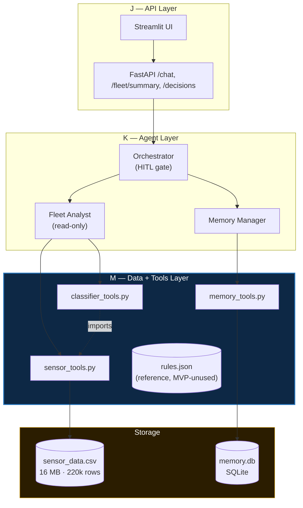

**The contract:** every M function returns JSON-serializable types (dict/list/primitive). No DataFrames, no `np.int64`. This is what lets LangChain's tool serializer not mangle results in the agent trace.

---

## 2. Module Dependency Graph

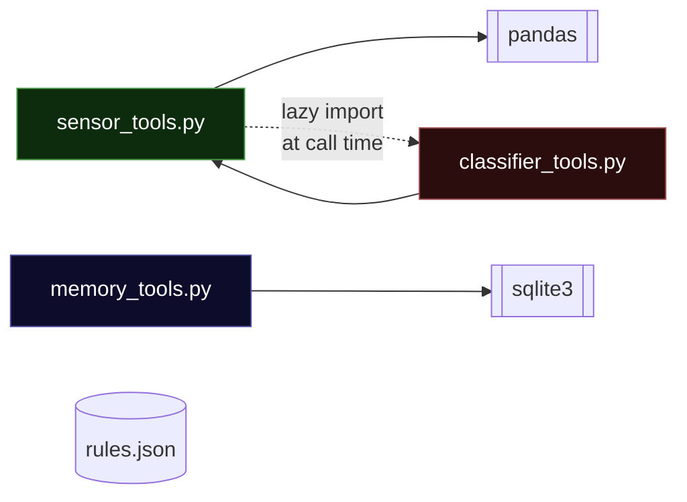

**Why the lazy import?** `classifier_tools` imports `compute_utilization_stats` from `sensor_tools`. But `sensor_tools.get_fleet_summary` needs to classify every IPC, so it calls `classify_ipc`. That's a circular import at module-load time — the lazy `from app.tools.classifier_tools import classify_ipc` inside `get_fleet_summary` breaks the cycle by deferring it to call time. `memory_tools` is fully independent — no cross-imports with the other two.

---

## 3. `sensor_tools.py` — Data Loading & Stats

### 3.1 Load Pipeline

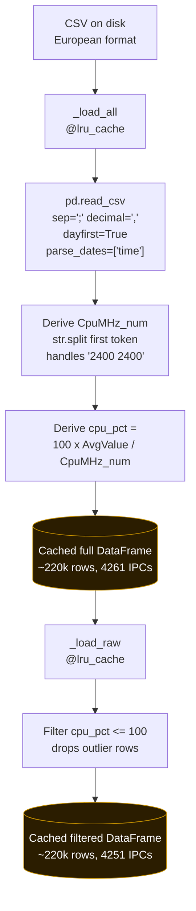

**Two-level cache.** Both `_load_all` and `_load_raw` are `@lru_cache(maxsize=1)`, so the CSV is parsed exactly once per process. The split is necessary because:

- **Stats functions** (`compute_utilization_stats`, `get_ipc_history`) want filtered data — outlier rows would corrupt p95.
- **`get_fleet_summary`** wants the *unfiltered* IPC list — otherwise the 10 outlier-only IPCs (e.g. `ITLT1593` with rated 9,600 MHz but reported 300,000 MHz) vanish from the count, and `total_ipcs` becomes 4251 instead of the spec'd 4261.

### 3.2 Public Surface

| Function | Signature | Returns |
|---|---|---|
| `load_sensor_data` | `(ipc_id: str \| None = None)` | filtered DataFrame, optionally narrowed to one IPC |
| `compute_utilization_stats` | `(ipc_id: str)` | `{ipc_id, mean, p50, p95, max, days_observed}` |
| `get_fleet_summary` | `()` | `{total_ipcs, count_per_label, factory_breakdown}` |
| `get_ipc_history` | `(ipc_id, days=30)` | `[{date, cpu_pct}, ...]` |

### 3.3 The CPU% Calculation

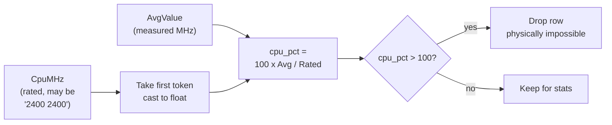

This is the non-obvious derivation the architecture spec mandates. The CSV ships raw MHz; utilization % is a derived feature added at load time.

---

## 4. `classifier_tools.py` — Threshold Classification

### 4.1 Decision Tree

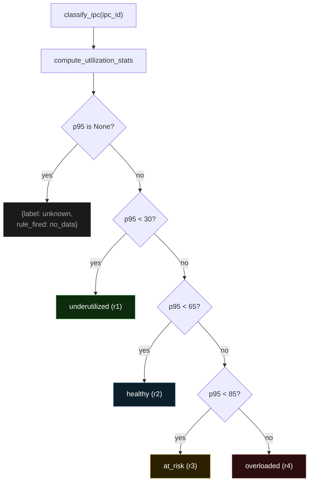

### 4.2 Observed Fleet Distribution

| Label | Threshold | Count | % |
|---|---|---|---|
| `underutilized` | `p95 < 30` | 3,923 | 92.1% |
| `healthy` | `30 <= p95 < 65` | 264 | 6.2% |
| `at_risk` | `65 <= p95 < 85` | 44 | 1.0% |
| `overloaded` | `p95 >= 85` | 20 | 0.5% |
| `unknown` | no usable rows | 10 | 0.2% |
| **Total** | | **4,261** | |

### 4.3 `rules.json` — Spec Reference, MVP-Unused

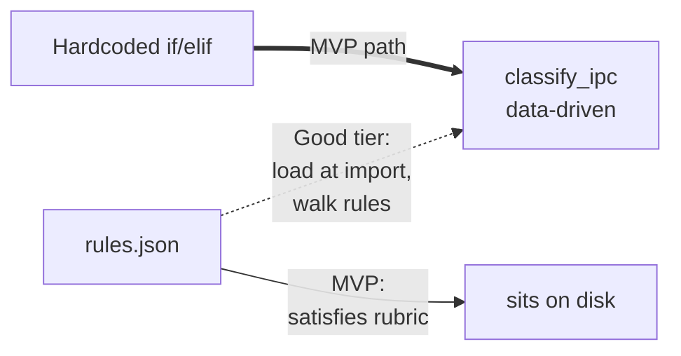

### 4.4 `flag_anomalies` — Audit Tool

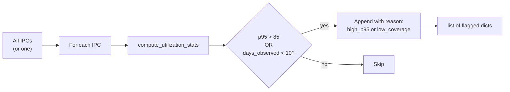

---

## 5. `memory_tools.py` — HITL Persistence

### 5.1 SQLite Schema

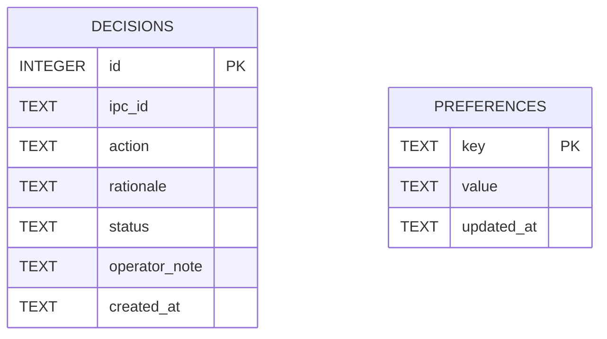

Two flat tables, no foreign keys. `decisions` is append-only — operator history is immutable. `preferences` is reserved for the Good tier (e.g. "always reject decommission for Factory 5").

### 5.2 Lifecycle of a Decision

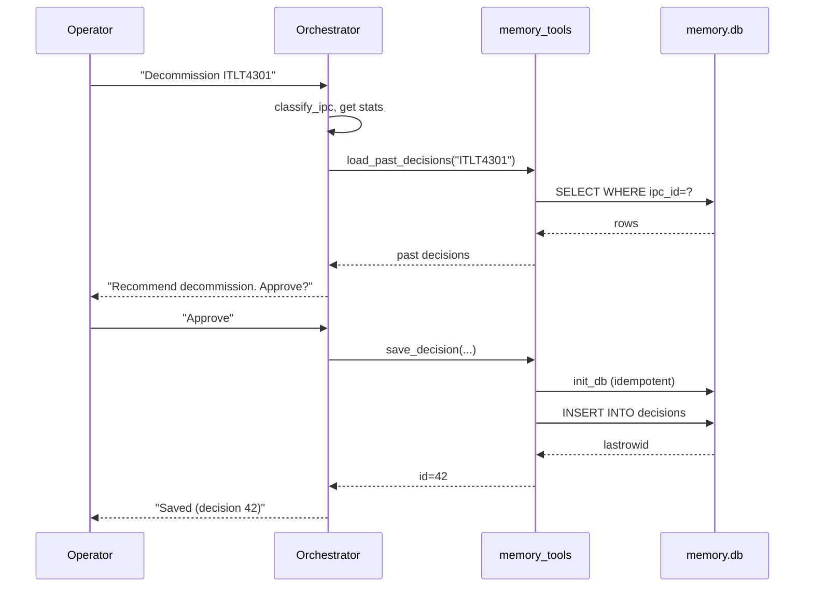

**Two important design points:**

1. **`init_db` is idempotent and called by every write.** No bootstrap step. The first `save_decision` on a fresh deploy creates the schema via `CREATE TABLE IF NOT EXISTS`.
2. **The connection is per-call, not pooled.** `_conn()` opens/commits/closes per operation. Fine for SQLite at this scale and avoids threading concerns with FastAPI.

### 5.3 `get_session_context` — Memory Bridging

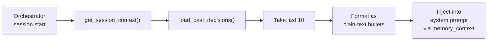

---

## 6. End-to-End Data Flow (Demo Path)

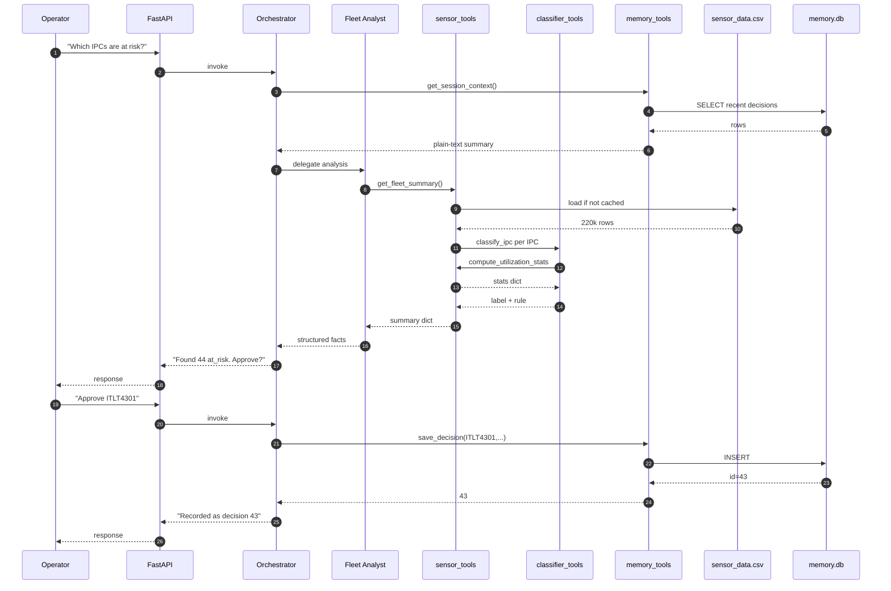

---

## 7. Failure Modes & Defenses

| Failure | Defense in M's layer |
|---|---|
| CSV missing | Plain `FileNotFoundError` with the path in the message |
| CSV not European-formatted | Explicit `sep=";"`, `decimal=","` — never silently misparsed |
| IPC has no rows / all-outlier rows | `compute_utilization_stats` returns `{p95: None, days_observed: 0}` |
| Unknown IPC passed to classifier | Returns `{label: "unknown", rule_fired: "no_data"}` |
| `memory.db` directory missing | `os.makedirs(..., exist_ok=True)` in `_conn()` |
| `np.int64` in tool return values | All scalars cast to `int()`/`float()` before return |

---

## 8. Cache Map

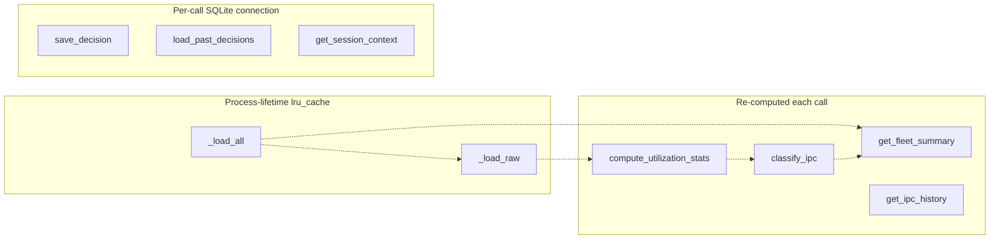

`get_fleet_summary` is the slow path — 4,261 sequential `compute_utilization_stats` calls (~5s cold). Acceptable for MVP demo; vectorizable with a single `groupby("IPC")["cpu_pct"].quantile(0.95)` if needed.

---

## 9. Definition of Done

| Spec item | State |
|---|---|
| `data/sensor_data.csv` mountable (gitignored, copy manually) | done |
| `sensor_tools.py` — 4 public fns, JSON-safe, cached | done |
| `classifier_tools.py` — `classify_ipc` + `flag_anomalies` | done |
| `rules.json` — four MVP thresholds | done |
| `memory_tools.py` — save/load/context + idempotent init | done |
| `total_ipcs == 4261` E2E verified | done |
| All 4 labels populated | done |
| Decision SQLite round-trip verified | done |
| No `print()` in production modules | done |
| Branch merged to master | done (commit d89a750) |
